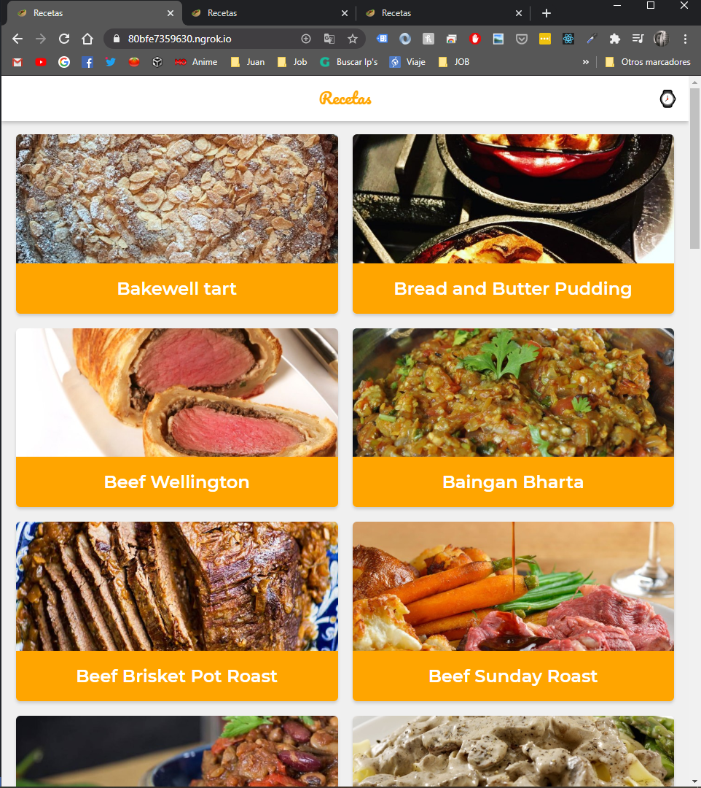

# Curso de PWA con Recat en Platzi

PWA que utiliza la API de MealDB para mostrar recetas con sus instrucciones.
Algunas de las features que tiene son:

* Soporte Offline con workbox
* Estrategias de Red apropiadas para cada recurso
* Add to Home Screen
* Web Share API

-- Se usa tambien ngrok

## Scripts

* `npm install` para instalar las dependencias
* `npm run dev` para entorno de desarrollo
* `npm run build && npm start` para producción en caso de si usa win enves de usar && usar AND

## Licencia

MIT

Este repositorio contiene todo el contenido del curso a medida que construimos una app para ver recetas con la API de MealDB.

Hay un branch por clase para que puedas navegar con facilidad el curso.

This project was bootstrapped with [Create React App]
(https://github.com/facebookincubator/create-react-app).
